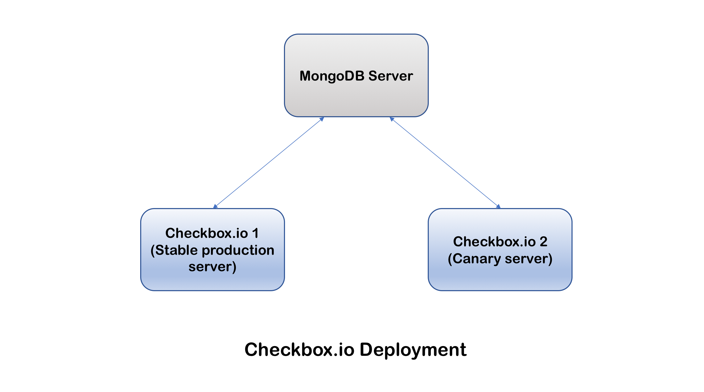
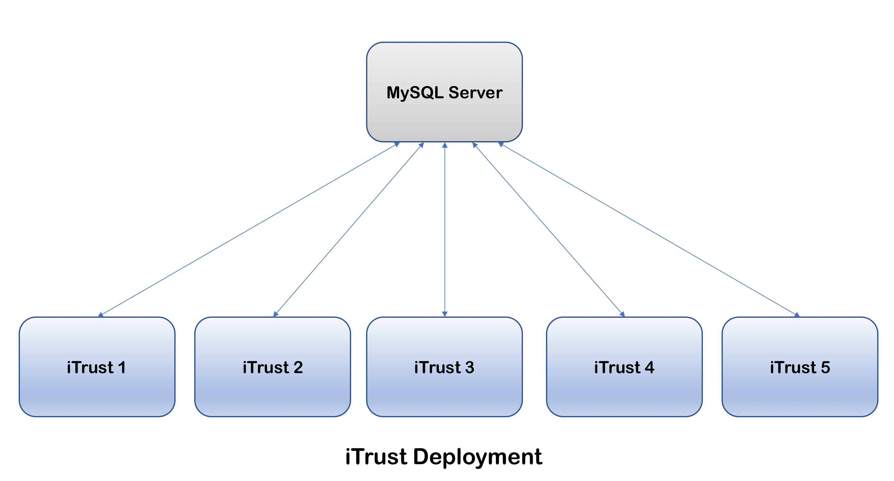
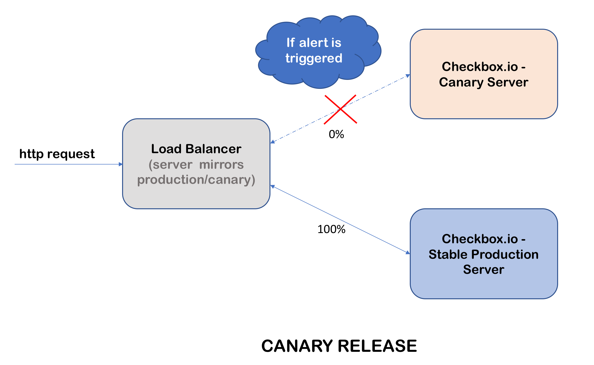
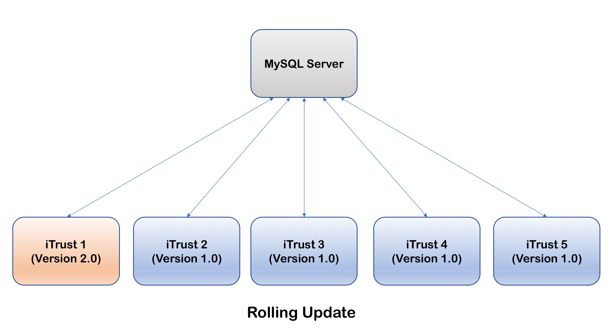

# Deployment Milestone

## Team Members

| Name | Unity ID |
| --- | --- |
| Rishi Jain | rjain9 |
| Omkar Acharya | oachary |
| Shriyansh Yadav | scyadav |
| Urmil Parikh | uparikh |

## Screencast

### [Checkbox Deployment, Canary Release, Redis Feature Flag](https://youtu.be/CCGi_iMIrP8)  
### [iTrust Deployment, Rolling Update](https://youtu.be/taxZHjd4NmY) 
### [Kubernetes Cluster](https://youtu.be/E8VysVK6rA0)

## Instructions for Execution

#### Environment Variables

* Add the following environment variables in `/etc/environment` file before running ansible scripts (Sometimes `sudo` can't access these variables if you put them in `~/.bashrc` or use `export` from terminal)  
```
 1. GITHUB_NAME="First Last"
 2. GITHUB_EMAIL=<unityid>@ncsu.edu
 3. GITHUB_USERNAME=<unityid>
 4. GITHUB_PASSWORD=<password>
 5. MAIL_FROM=<gmail username>
 6. MAIL_USER=<gmail username>
 7. MAIL_PASSWORD=<gmail password>
 8. MAIL_SMTP=smtp.gmail.com
 9. MONGO_USER=<mongo_user>
10. MONGO_PASSWORD=<mongo_password>
11. MONGO_IP=localhost
12. MONGO_PORT=3002
13. AWS_REGION=<aws region>
14. AWS_ACCESS_KEY=<aws access key>
15. AWS_SECRET_KEY=<aws secret token>
```

#### For everything except Kubernetes
* Run [provision-jenkins](src/provision-jenkins.yml) using `ansible-playbook -i inventory provision-jenkins.yml`

#### For Kubernetes
* Run [provision-kubernetes](src/provision-kubernetes.yml) using `ansible-playbook provision-kubernetes.yml`

#### GitHub Repositories: [iTrust2](https://github.ncsu.edu/oachary/iTrust2-v2/tree/production) | [checkbox.io](https://github.com/rjain9/checkbox.io/tree/production)
* We are using our forked repositories as we are making changes to demonstrate the deployment stratagies

## AWS-EC2 Instances

* We created 7 AWS-EC2 instances for Deployment, Redis Feature Flag, Canary Release and Rolling Updates.

  | Instance No. |  Role |
  | --- | --- |
  | 1 | Jenkins Server, Redis master, Loadbalancer(proxy for checkbox.io), Monitoring of Rolling update (Heartbeat) |
  | 2 | MySQL,server, MongoDB server |
  | 3 | iTrust server, Checkbox.io server |
  | 4 | iTrust server, Checkbox.io server |
  | 5 | iTrust server |
  | 6 | iTrust server |
  | 7 | iTrust server |

* We created 4 other AWS-EC2 instances for Kubernetes Cluster

  | Instance No. |  Role |
  | --- | --- |
  | 1 | Master |
  | 2 | Node |
  | 3 | Node |
  | 4 | Node |

## Deployment

### Checkbox.io Deployment



### iTrust Deployment



## Infrastructure Upgrade

### Kubernetes

### Redis Feature Flag


## Canary Release
We implemented canary releasing by using a load balancer which balances traffic between servers. When an alert is raised (when the canary server is down), all the traffic is redirected to the stable production server. The diagramatic representation of the same is as follows:




## Rolling Updates
For this part, we created 5 EC2 instances as the production servers for iTrust and 1 EC2 instance as the central MySQL server for all of them. Using Rolling Update deployment strategy, whenever any new code is pushed to the remote repository, all the servers are redeployed one by one. This can be demonstrated as follows:

