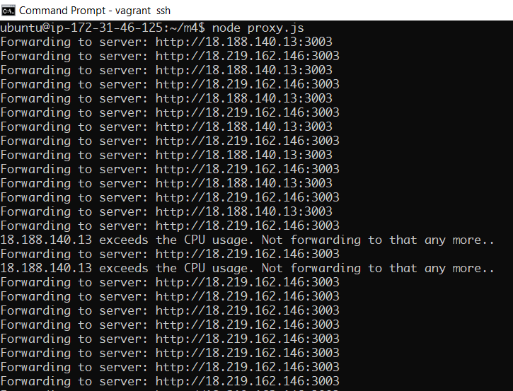
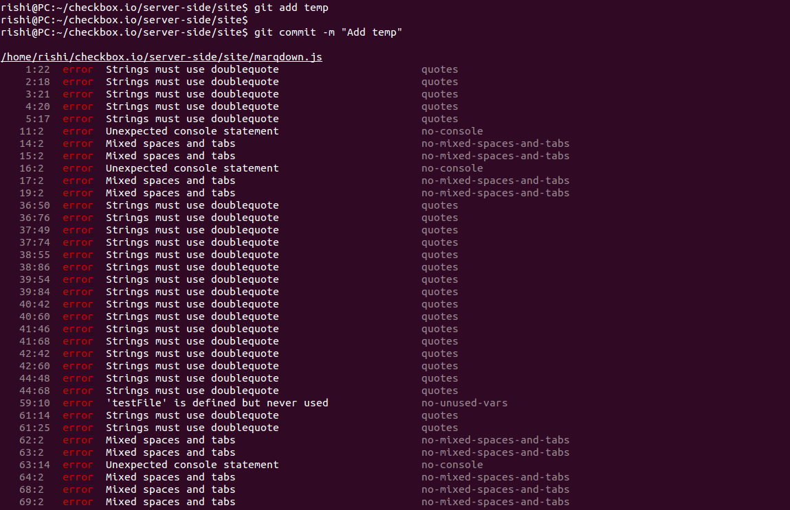

# CSC 519 DevOps: Special Milestone

## Team Members

| Name | Unity ID |
| --- | --- |
| Rishi Jain | rjain9 |
| Omkar Acharya | oachary |
| Shriyansh Yadav | scyadav |
| Urmil Parikh | uparikh |

## Complete DevOps Pipeline Demo: [Link]()
## Special Milestone Demo: [Link]()

## 1. Doctor Monkey

### Concept

* As [Netflix](https://medium.com/netflix-techblog/the-netflix-simian-army-16e57fbab116) describes, `Doctor Monkey` taps into health checks that run on each instance as well as monitors other external signs of health (e.g. CPU load) to detect unhealthy instances. Once unhealthy instances are detected, they are removed from service and after giving the service owners time to root-cause the problem, are eventually terminated.

* We have implemented `Doctor Monkey` which stops forwarding the requests from the `proxy server` to that `checkbox.io` server whose `CPU Usage` exceeds the threshold. For the demo purpose, we have set the threshold of only **10%**. In the real scenario, this should be set to a high value.

### Implementation

* We extended the same code base from the previous [Deployment](https://github.ncsu.edu/rjain9/CSC519DevOps-Project/tree/Deployment) milestone. 

* First, follow instruction from Deployment Milestone's [README](https://github.ncsu.edu/rjain9/CSC519DevOps-Project/tree/Deployment/README.md). **Make sure that both checkbox.io servers are up and running before running the proxy server.** 

* You may want to change the checkbox server IPs in [checkbox-servers](doctor-monkey/checkbox-servers). We used the same `Jenkins` server from the previous milestone as our proxy server. So, you may also want to modify [this](doctor-monkey/server.js#L22) IP address and put the `Jenkins` server IP address. Make sure that this same [server.js](doctor-monkey/server.js) file with the updated IP is present on the two checkbox servers. If not, stop the current servers and reboot them with the updated server file. 

* Next, run the proxy server,
```bash
$ npm install
$ node server.js
```

* We modified `checkbox.io` server script to add an endpoint `/cpu`, which returns the percent cpu usage. The modified version of checkbox.io is available [here](https://github.com/rjain9/checkbox.io/tree/special/server-side/site).

* Our [proxy](doctor-monkey/proxy.js) continuously checks for cpu usage for all the servers and doctor monkey stops forwarding the requests to that server.

* Below is the screenshot of the proxy server's output. Until the threshold was not exceeded, it was toggling between the two checkbox servers. As soon as the threshold was exceeded by one of the servers, the proxy server stopped forwarding the requests to that server.

* **Proxy Server Console Output:**
  
  

### References
* [Medium.com](https://medium.com/netflix-techblog/the-netflix-simian-army-16e57fbab116)
* [TechTarget](https://whatis.techtarget.com/definition/Simian-Army)
* [Wired](https://www.wired.com/2014/07/security-monkey/)


## 2. Load Handler
  
### Concept
When multiple simultaneous POST requests are made to a server, it utilizes a huge chunk of the server memory, thus slowing it down. In extreme cases the server may even crash. So to prevent such a thing a good technique would be to send the server in a read-only mode where it wont accept any POST request but the content is still accessible through a GET request. The transition would be made when the memory usage exceeds a certain percentage.
  
### Implementation
For implementing it, follow these instructions -
* Run the updated checkbox.io server.
* Change the IP in post.js to the server IP.
* Run post.js - ``` node post.js```
* You will observe that the server slows down after a few requests. This makes the server go into a read only mode.
* Any subsequent POST request made to the server won't work. Only the GET requests work.
* So the content of the server is accessible to the users but they can't POST new content.

## 3. ESLint

### Concept
`ESLint` is an open source JavaScript linting utility. Code linting is a type of static analysis that is frequently used to find problematic patterns or code that doesn’t adhere to certain style guidelines. It allows to create our own linting rules.

### Implementation:
* Install ESLint: 
```bash
npm install eslint
```
* Initialize rules: 
```bash
./node_modules/.bin/eslint --init
```
* Created rules can be seen using:
```bash
cat .eslintrc.json
```
* Copy this [pre-commit](eslint/pre-commit) hook to `.git/hooks/` of `checkbox.io` 
* Now, on commiting the files (`git commit -m <message>`), ESLint will check the codestyle of the codebase for all the JavaScript Files and it gives the output as:
  
  


## Individual Contribution:
**Omkar Acharya (oachary):**
* `Doctor Monkey` setup and implementation
* `Checkbox.io` proxy server implementation
* Screencast and README for the above

**Rishi Jain (rjain9):**

**Shriyansh Yadav (scyadav):**

**Urmil Parikh (uparikh):**
* Implemented the `Load Handler` part.
* Wrote the code for sending simultaneous multiple POST requests to the server.
* Screencast and README for the above.
