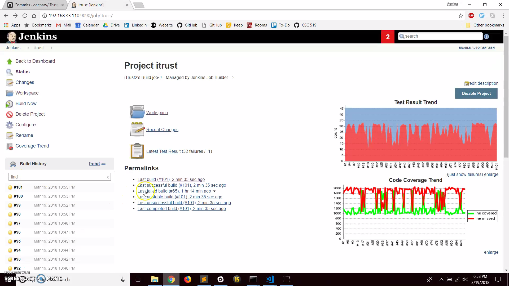
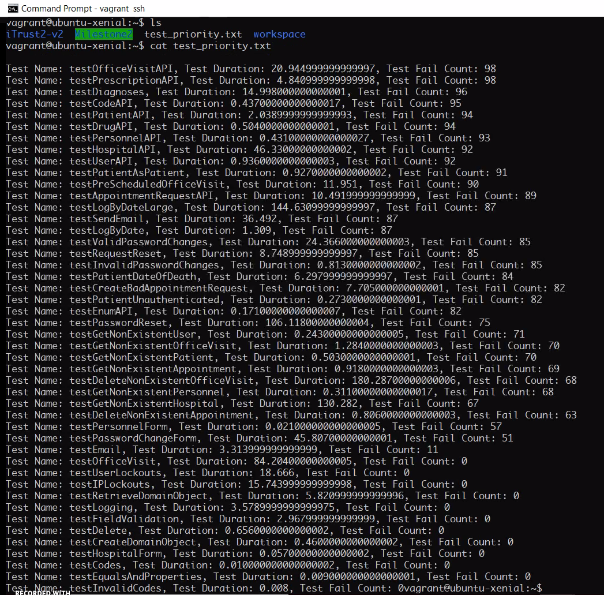

# Test + Analysis Milestone:

We have used techniques related to fuzzing, test case priorization, and automated test generation to improve the quality of checkbox.io and iTrust.

## Team Members:

|  Team Member |   UnityId |  
|  ---   |  ---   |  
|  Rishi Jain  |    rjain |  
|  Omkar Acharya  |    oachary  |  
|  Shriyansh Yadav   |  scyadav  |
|  Urmil Parikh   |  uparikh   |

## Screencast:  **[Checkbox](https://www.youtube.com/watch?v=n1GZSuzz6Mo&feature=youtu.be) | [iTrust](https://www.youtube.com/watch?v=sFB0MfV1lbM&feature=youtu.be)**


## Instructions for Code execution:  

* Clone this repository at `/home/vagrant/` (Since, we have been working on a fresh installation of vagrant machine, we have used `/home/vagrant/` directory as the home directory. To replicate this, make sure that this path exists)
* Make sure that you have `ansible` installed on your machine
```
git clone https://github.ncsu.edu/rjain9/CSC519DevOps-Project.git
```
* Change directory to `CSC519DevOps-Project`
```
cd CSC519DevOps-Project
```
* Checkout `TestAnalysis` branch
```
git checkout TestAnalysis
```
* Add the following environment variables in `/etc/environment` file (Sometimes `sudo` can't access these variables if you put them in `~/.bashrc` or use `export` from terminal)  
```
 1. GITHUB_NAME="First Last"
 2. GITHUB_EMAIL=<unityid>@ncsu.edu
 3. GITHUB_USERNAME=<unityid>
 4. GITHUB_PASSWORD=<password>
 5. MAIL_FROM=<gmail username>
 6. MAIL_USER=<gmail username>
 7. MAIL_PASSWORD=<gmail password>
 8. MAIL_SMTP=smtp.gmail.com
 9. MONGO_USER=<mongo_user>
10. MONGO_PASSWORD=<mongo_password>
11. MONGO_IP=localhost
12. MONGO_PORT=3002
```
* Since, we have a single ansible playbook for both `iTrust` and `checkbox.io`, you might want to comment the other roles from `jenkins/main.yml`  
  * For `iTrust` tasks, use `jenkins` and `itrust` roles and comment `checkbox` role
  * For `checkbox` tasks, use `checkbox` role and comment `jenkins` and `itrust` roles
* Now, run the script using
```
ansible-playbook jenkins/main.yml
```

## Coverage/Jenkins Support (10 points)

### iTrust
After adding `JaCoCo` plugin to jenkins to measure coverage, it generates the code coverage report on Jenkins dashboard on every commit  


### Checkbox

The automated test generations   


## Automated Commit Fuzzer (25 points)

We have implemented the fuzzer using `Python`. It automatically commits new random changes to the source code and triggers a new build every time after the changes. We have performed the following changes with randomness:  

   - change content of "strings" in code.
   - swap "<" with ">"
   - swap "==" with "!="

**Approach:**
* We have cloned a [copy](https://github.ncsu.edu/oachary/iTrust2-v2/tree/fuzzer) of [iTrust2-v2](https://github.ncsu.edu/engr-csc326-staff/iTrust2-v2) for implementing fuzzing (TODO)
* Initially, we have created a new branch for `iTrust2-v2`, called `fuzzer`.
* Then, we run the `run_fuzzer.py` which does the following until we get 100 successful builds:
      * Performs fuzzing on all `.java` files in `iTrust2-v2/iTrust2/src/main/java/edu/ncsu/csc/itrust2`
      * Compiles it (using `mvn compile` command)
      * If successful:
            * Commits the changes
            * Triggers the jenkins job which creates a new build 
            * Reverts the changes by `git revert --no-edit HEAD`
      * If failed:
            * Resets the changes by `git reset --hard HEAD`
* In either case, we have handled the rollback (reverting/resetting the committed changes) after completing every build in jenkins

### Problems the fuzzer discovered:

The fuzzer was successful in finding out:
* Whether the files contain hard-coded string values
* Whether 


### Extending fuzzing operations: 

* The fuzzing operations can be extended using certain additions like:
     *
     *

## Test prioritization analysis (25 points)



We have created a function in the `python` script to perform test priorization analysis that examines the results 
of the 100 commit fuzzer runs and test suite runs. It outputs a report `test_priority.txt` in the root directory (`/home/vagrant/`) that displays the test cases in sorted order, based on time to execute and number of failed tests discovered.

### Approach:

* Combine `JUnit`'s build job reports `junitResult.xml` for all the successful builds
* Find out the number of test cases failed for each build.
* Sort the test cases based on the number of times the tests failed.
* In case there is a tie, find out the test case run duration, and use it further for sorting the tests.
* Generate a report using the sorted tests as a text file (`test_priority.txt`)
     
### Ranking the test cases:

* In the test case prioritization report, the tests which never failed (even after fuzzing) and hence are not useful in detecting errors in code. Thus, those are the useless tests.
* Some unit tests like `testCodes`, `testFieldValidation`, `testOfficeVisit`, etc. never fail and hence are useless.
* API tests like `testOfficeVisitAPI`, `testDiagnoses`, `testDrugAPI`, etc. fail most of the times after fuzzing and hence help to catch bugs.

## Automated Test Generation (25 points)

We have implemented Automated test generation to analyze checkbox.io's server-side code, that automates the
generation of test cases for the API routes in server.js file of checkbox.io

### Approach:
* Used the code for automating test generation written in HW2.   
* Used esprima to search for any API calls in server.js.  
* Created a Javascript object, for each occurrence of API, to store both method and route. 
* Each of these objects is pushed to an array and passed to the test generator file.  
* Created request for assigning proper routes, methods and options, for test generation. 
* Data for options is created and stored in a test database. 
* Options considered are such that they cover as much branches as possible. 
* Istanbul-middleware is used to calculate the coverage for the test file. 
* 28 test cases were written, each covering different cases.

### Coverage:
The Branch coverage obtained is about 75%. That is for all the files in routes directory.

### Issues
We were not able to write test case covering the upload file. Also some branches in study.js were difficult to cover.

## Individual Contribution:
Omkar's Contribution:

Rishi's Contribution:
* Initial checkbox and iTrust set up.
* Set up the Jenkins server to work with Jacoco and show iTrust’s initial coverage.
* Added schemas and model code and initial test generator code for checkbox.io. 
* Initially testing on checkbox.io by manually adding data using postman and hitting api.
* Added the code for Istanbul middleware to work with checkbox.io .

Shriyansh's Contribution:
* Worked with Ansible script to setup iTrust locally.
* Paired up with Rishi to work on generating JaCoCo coverage reports by debugging errors during iTrust build. 
* Worked on fuzzing initially.  
* Prepared README.md and checkbox screencast

Urmil's Contribution
 * Manually analysed checkbox.io to discover different kind of API calls
 * Changed HW2 code (constraints.js and testgeneration.js) to handle API requests.
 * Automated generation of test.js
 * Created test db to store test values for get request calls.
